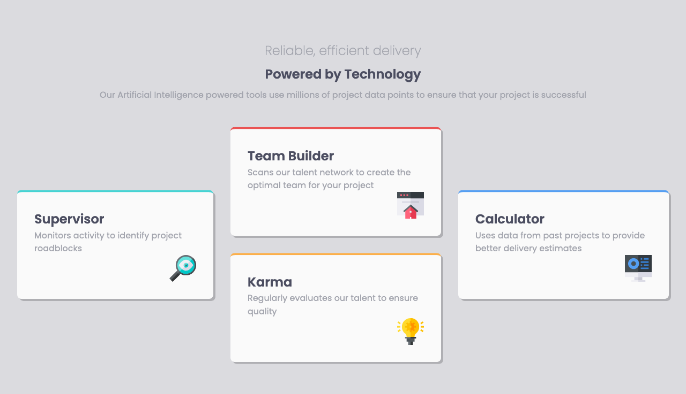
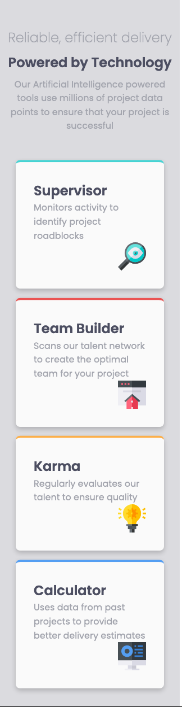

# Frontend Mentor - Four card feature section solution

This is a solution to the [Four card feature section challenge on Frontend Mentor](https://www.frontendmentor.io/challenges/four-card-feature-section-weK1eFYK). Frontend Mentor challenges help you improve your coding skills by building realistic projects.

## Table of contents

- [Overview](#overview)
  - [The challenge](#the-challenge)
  - [Screenshot](#screenshot)
  - [Links](#links)
- [My process](#my-process)
  - [Built with](#built-with)
- [Author](#author)

## Overview

### The challenge

Users should be able to:

- View the optimal layout for the site depending on their device's screen size

### Screenshot

### Links

- Solution URL: [Github](https://github.com/will-lucena/four-card-feature-selection)
- Live Site URL: [Live demo on Vercel](https://four-card-feature-selection-seven.vercel.app/)

## My process

### Built with

- HTML5
- CSS3
- Flexbox
- Mobile-first workflow
- [VueJs](https://vuejs.org/) - JS library
- [BEM](http://getbem.com/introduction/) - For styles
- [Vercel](https://vercel.com/) - For deployment

## Author

- Website - [Will Lucena](https://will-lucena.github.io/)
- Frontend Mentor - [@will-lucena](https://www.frontendmentor.io/profile/will-lucena)
